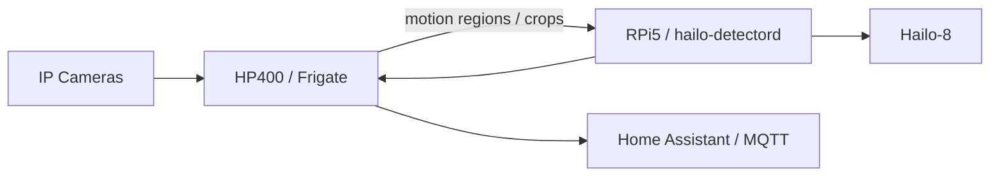
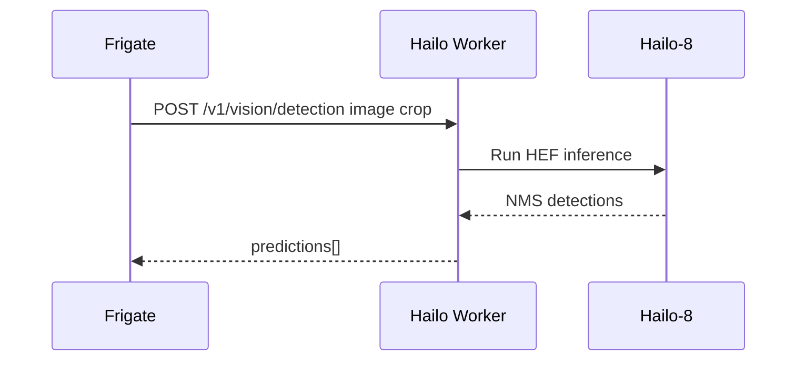
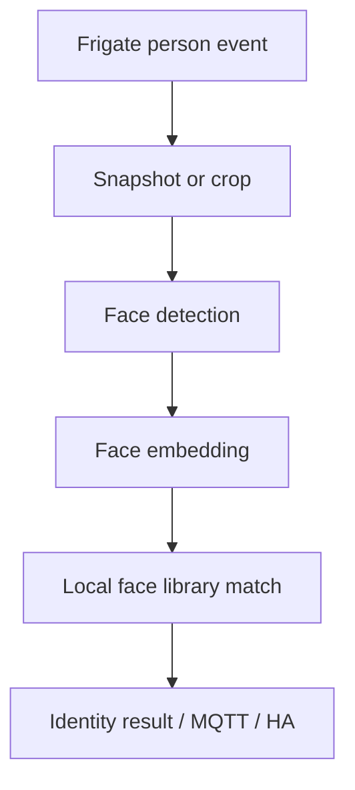

# Architecture

## Purpose

`frigate-remote-hailo-worker` is a remote inference worker for Frigate. Frigate remains the NVR, camera ingest system, motion detector, tracker, recorder, and event owner. This service runs separately on a Raspberry Pi 5 with a Hailo-8 accelerator and handles inference requests over HTTP.

## Target Deployment

## Responsibility Split

### Frigate / HP400

- RTSP camera ingest
- Video decode
- Motion detection
- Region generation
- Object tracking
- Event lifecycle
- Recording and snapshots
- Home Assistant and MQTT integration

### Hailo Worker / RPi5

- Object detection endpoint
- Face detection endpoint scaffold
- Face recognition API scaffold
- Optional debug capture
- Metrics and version endpoints
- Public API/RapidAPI-protected endpoints

## Object Detection Flow

## Face Recognition Direction

Current face recognition uses deterministic development-only embeddings. This is suitable for API and workflow testing only.

Target flow:

Preferred production backend: InsightFace or ArcFace first, with optional Hailo embedding support later.

## Public API Layer

The `/public/...` endpoints are separate from LAN/internal Frigate endpoints and are protected by either direct API keys or RapidAPI provider headers.

## Current Maturity

Status: Alpha.

Core API architecture exists. Operational tooling, real face recognition, Hailo model compatibility hardening, installer safety, and live Frigate validation are still in progress.
